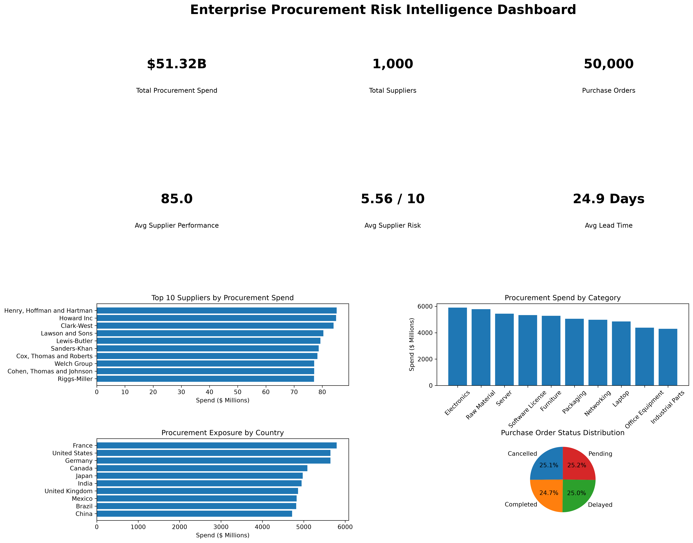

# Enterprise Procurement Risk Intelligence

## About the Project

I built this project to explore how procurement data can be used to understand supplier performance, spending patterns, operational efficiency, and supply risk.

The idea was to work with a realistic enterprise procurement environment rather than analyze a single flat dataset. The project includes **1,000 suppliers, 2,000 products, 50,000 purchase orders, and suppliers across 10 countries**.

I used **SQL and SQLite** to structure and query the data, and **Python, Pandas, and Matplotlib** for analysis and visualization. The final output is an executive procurement dashboard that brings the most important findings together in one view.

---

## Business Problem

A procurement team managing thousands of purchase orders needs more than transaction-level data. They need to understand questions such as:

- Which suppliers account for the highest procurement spend?
- Which product categories are driving costs?
- Are there suppliers that may require closer risk monitoring?
- Which countries represent the largest procurement exposure?
- How long does it typically take for orders to be delivered?
- What proportion of purchase orders are completed, delayed, pending, or cancelled?

I designed this project around these questions and built the analysis from the perspective of a procurement or business analytics team.

---

## Executive Dashboard



The dashboard summarizes the overall procurement environment and provides a quick view of supplier, spending, country, and purchase-order performance.

### Key Metrics

| Metric | Result |
|---|---:|
| Total Procurement Spend | $51.32B |
| Total Suppliers | 1,000 |
| Purchase Orders | 50,000 |
| Average Supplier Performance | 85.0 |
| Average Supplier Risk | 5.56 / 10 |
| Average Lead Time | 24.9 Days |

---

## What I Analyzed

### Supplier Performance and Spend

I compared suppliers based on their procurement spend and performance metrics. This helps identify suppliers with high financial exposure and provides a starting point for evaluating important supplier relationships.

### Procurement Spend by Category

I grouped purchase-order spending by product category to understand where procurement dollars are concentrated across the organization.

### Supplier Risk

I analyzed supplier risk alongside performance, country, and procurement spend. Looking at these measures together provides more context than evaluating a supplier using a single risk score.

### Country Exposure

I connected supplier locations with procurement transactions to understand how much purchasing activity is associated with each country and its corresponding risk level.

### Lead Time

Using purchase-order and delivery dates, I calculated the average lead time across orders. The overall average in the dataset is approximately **24.9 days**.

### Purchase Order Status

I analyzed the distribution of purchase orders across **Completed, Pending, Delayed, and Cancelled** statuses to get a high-level view of procurement operations.

---

## Tools Used

- **SQL** – querying, joins, aggregations, and business analysis
- **SQLite** – relational database used to store the procurement data
- **Python** – analysis and automation
- **Pandas** – data manipulation and SQL result analysis
- **Matplotlib** – data visualization and dashboard creation
- **Jupyter Notebook** – initial project setup and exploration
- **VS Code** – development environment
- **Git & GitHub** – version control and project documentation

---

## Project Workflow

I approached the project as an end-to-end analytics workflow:

**Raw Data → Data Validation → SQLite Database → SQL Analysis → Python Analysis → Risk Analysis → Executive Dashboard**

The process included:

1. Creating structured procurement datasets for suppliers, products, countries, and purchase orders.
2. Checking the data for consistency and validating relationships between tables.
3. Loading the data into a SQLite database.
4. Writing SQL queries to answer procurement-related business questions.
5. Using Python and Pandas for additional analysis.
6. Evaluating supplier and country-level risk.
7. Building an executive dashboard to communicate the main results.

---

## Project Structure

```text
enterprise-procurement-risk-intelligence/
│
├── data/
│   └── raw/
│       ├── countries.csv
│       ├── products.csv
│       ├── purchase_orders.csv
│       └── suppliers.csv
│
├── notebooks/
│   └── 01_Project_Setup.ipynb
│
├── reports/
│   └── executive_procurement_dashboard.png
│
├── sql/
│   ├── business_analysis.sql
│   ├── create_database.py
│   ├── create_tables.sql
│   ├── data_validation.sql
│   └── procurement_analysis.sql
│
├── src/
│   ├── analysis_category_spend.py
│   ├── analysis_country_risk.py
│   ├── analysis_leadtime.py
│   ├── analysis_order_status.py
│   ├── analysis_supplier_performance.py
│   ├── analysis_supplier_risk.py
│   ├── executive_dashboard.py
│   ├── generate_master_data.py
│   └── procurement_analysis.py
│
├── business_problem.md
├── data_dictionary.md
├── requirements.txt
├── .gitignore
└── README.md
```

---

## Key Takeaways

One of the main things I wanted to demonstrate through this project was the connection between technical analysis and business decision-making.

Instead of looking only at total spend, the analysis brings together **supplier performance, supplier risk, lead time, purchasing activity, category concentration, and geographic exposure**.

The final dashboard makes it easier to identify areas that may deserve further investigation, such as high-spend suppliers, major spending categories, geographic concentration, and order-status patterns.

---

## What I Would Add Next

If I continue developing this project, the next steps would be:

- Build an interactive **Power BI or Tableau dashboard**
- Develop a supplier risk scoring or prediction model
- Add procurement spend forecasting
- Detect unusual purchasing patterns or anomalies
- Segment suppliers based on spend, performance, and risk
- Automate recurring procurement reporting

---

## Author

**Ayush Mathur**

M.S. Business Analytics  
Montclair State University